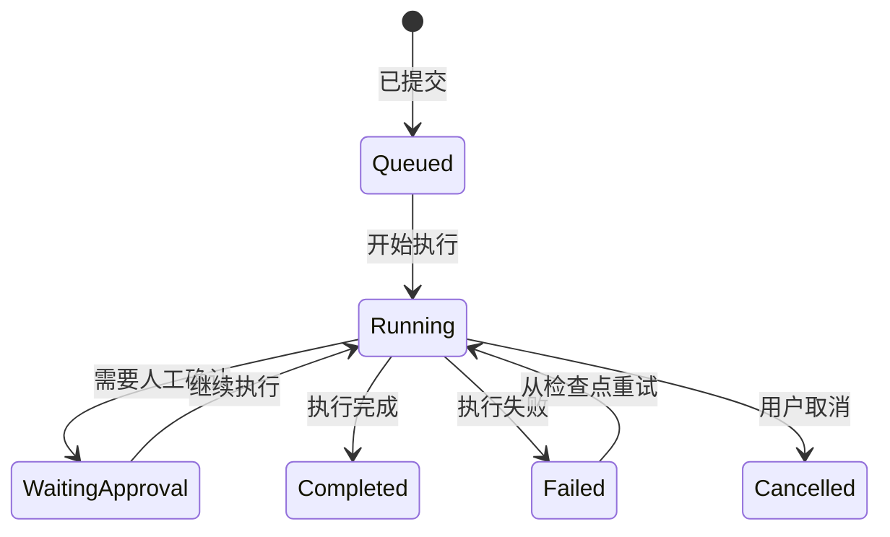

# xLumen 前端开发文档

> 更新日期：2026/8/12
> **本仓库专属**。
> 适用范围：前端工程结构、开发边界、交互约定与质量门禁。
> 引用原则：**引用不复制**——产品范围与功能清单以[产品设计文档](../product/PRODUCT.md)第 5 节总表为准（引用功能编号 F-xxx，不维护功能清单）；技术基线、版本与运行命令以[全局设计文档](../global/GLOBAL.md)为准；页面结构与线框见[前端原型文档](./PROTOTYPE.md)。

## 1. 文档目标

本文定义 xLumen 前端的工程结构、开发边界、交互约定和质量门禁。产品行为以[产品设计文档](../product/PRODUCT.md)（含内容状态机与 MVP 行为规则）为准，页面结构以[前端原型文档](./PROTOTYPE.md)为准，技术基线与命令以[全局设计文档](../global/GLOBAL.md)为准。文档冲突时，产品行为以 PRODUCT 为准、工程实现以本文为准。
## 2. 应用边界

| 应用 | 目录 | 端口 | 用户 | 核心职责 |
| --- | --- | --- | --- | --- |
| 博客前台 | `frontend/xlumen-frontend-blog/` | 5173 | 访客、登录读者、博主（OWNER） | 文章展示/阅读/互动、AI 助理对话（[AI 助理] 菜单入口，F-0701）、创作中心（创作/审校/审核/发布） |
| 管理后台 | `frontend/xlumen-frontend-admin/` | 5174 | 仅管理员（OWNER/ADMIN） | 空间/成员/角色、模型配置、审计日志等配置管理，不参与内容流转 |

- 两个 pnpm 应用分别构建和运行；仓库根 `package.json` 通过 `pnpm --dir frontend/xlumen-frontend-blog` / `pnpm --dir frontend/xlumen-frontend-admin` 代理两应用脚本，质量门禁统一在仓库根执行（命令见 GLOBAL.md）。
- 两应用骨架在 M01 代码骨架阶段随仓库创建；blog 承载全部内容与互动功能（页面见 PROTOTYPE.md B/D 系列），admin 仅承载配置管理（A 系列），开发时不虚构已实现功能。
- 两应用共享 OpenAPI 生成规则、Design Token 与通用约定，不提前建设庞大公共组件包；出现两个以上稳定消费者后再抽取公共包。

## 3. 技术基线

技术栈（Vue 3.5、Vite 7、TypeScript 5.8 strict、Pinia 3、Element Plus、Vue Router、Axios、Vitest、Playwright、ESLint 9 flat config、Stylelint、Prettier）与 Node/pnpm 版本要求以[全局设计文档](../global/GLOBAL.md)为准，本文不重复维护版本清单。

依赖使用较新稳定版并锁定 minor 范围。升级 Vue、Element Plus、Vite、编辑器或构建工具时，必须单独执行兼容性验证，不与业务功能混合提交。

## 4. 设计原则

1. 页面组件负责编排，不承载复杂业务规则。
2. 服务端数据、跨页面状态和页面局部状态分开管理。
3. 所有长任务均展示当前阶段、进度、耗时、可取消性和恢复入口。
4. AI 生成内容始终标明来源、模型、状态和是否经过人工确认。
5. 权限控制同时用于导航、组件和操作提示，但前端权限不得替代后端鉴权。
6. 先实现桌面创作体验；平板支持审核；移动端支持查看和轻量审批。
7. 优先复用 VueUse、Element Plus 和成熟开源能力，不重复实现成熟的通用功能；确需引入新依赖时说明用途与替代方案；保持页面、组件和 Composable 简洁，不为形式统一建立无实际复用价值的抽象层。
8. 代码必须有必要的注释：组件写职责与关键 Props 说明，Composable 写用途与副作用，复杂交互、状态机与流式处理逻辑必须注释"为什么"；注释与代码同步更新，不写冗余注释。

## 5. 推荐目录

```text
frontend/xlumen-frontend-blog/src/     # 博客前台（含创作中心）
├─ api/                    # 请求客户端、拦截器、生成的 OpenAPI 类型
├─ assets/                 # 静态资源
├─ components/             # 跨业务通用组件
├─ composables/            # 跨业务组合式能力
├─ layouts/                # 博客、创作工作台、认证和全屏布局
├─ modules/
│  ├─ identity/            # 登录、注册（博主与读者，xlumen-identity，MVP）
│  ├─ blog/                # 首页、文章详情、搜索分类标签、关于（F-0201~0203）
│  ├─ content/             # 创作中心：文章列表、Markdown 编辑器、可见性（F-0301/0302/0307）
│  ├─ ai/                  # AI 创作任务：写作、审校、进度（F-0601~0604）
│  ├─ knowledge/           # 文章索引状态、检索测试（xlumen-knowledge，F-0402~0405）
│  ├─ publishing/          # 审核中心、发布管理（F-0901~0905）
│  ├─ chat/                # AI 助理对话菜单页 B00、文章级问答（F-0701/0702）
│  ├─ engagement/          # 评论、点赞、纠错（F-0203/F-1001）、通知（V2）
│  ├─ ai-enhance/          # 摘要、SEO、翻译等增值面板（F-0801~0805）
│  └─ workbench/           # 创作工作台 B09（聚合入口）
├─ router/                 # 路由、守卫和路由元数据
├─ stores/                 # 会话、空间和全局通知
├─ styles/                 # Design Token、Element Plus 覆盖和全局排版
├─ types/                  # 跨业务前端类型
├─ utils/                  # 无业务状态的纯函数
├─ App.vue
└─ main.ts
```

```text
frontend/xlumen-frontend-admin/src/    # 管理后台（仅管理员）
├─ api/ components/ composables/ layouts/ router/ stores/ styles/ types/ utils/
├─ modules/
│  ├─ identity/            # 管理员登录（F-0101）
│  ├─ workspace/           # 空间/成员/角色设置（F-1201/F-0102/F-0103）
│  ├─ model/               # 供应商密钥与场景模型配置（F-0501/F-0502）
│  ├─ audit/               # 审计日志（F-1202）
│  └─ analytics/           # 配额、数据看板、时效检测（V2/V3，F-0504/F-1101/F-1102）
├─ App.vue
└─ main.ts
```

blog 应用前端模块与后端 Maven 模块对应关系（后端模块职责与业务域见 [BACKEND.md](../backend/BACKEND.md)；后端共 7 个 Maven 模块，决策 D15；`xlumen-common` 为基座、`xlumen-boot` 为装配模块，均无独立前端模块）：

| blog 前端模块 | 对应后端模块 | 阶段 | 职责 |
| --- | --- | --- | --- |
| `identity` | xlumen-identity（iam_） | MVP | 登录/注册/登出（F-0101），博主与读者均在 blog 登录 |
| `blog` | xlumen-publishing（pub_，公开读） | MVP | 首页文章展示、详情、搜索分类标签、关于（F-0201/0202） |
| `content` | xlumen-content（cnt_） | MVP | 文章 CRUD 与编辑器（F-0301）、自动保存（F-0302）、可见性（F-0307）、版本/定时/回收站/图片（F-0303~0306，V2） |
| `ai` | xlumen-ai（ai_，gateway/writing 域） | MVP | AI 写作/大纲可选确认/审校任务页（F-0601~0604） |
| `knowledge` | xlumen-knowledge（kb_） | MVP | 文章索引状态与重建（F-0402/0403）、检索测试（F-0404）、引用溯源展示（F-0405） |
| `publishing` | xlumen-publishing（pub_，review/release 域） | MVP | 审核中心（F-0902~0904）、状态机与发布（F-0901/0905）、下架回滚（F-0906，V2） |
| `chat` | xlumen-ai（chat_，chat 域） | MVP | AI 助理对话菜单页 B00（F-0701）、文章级问答（F-0702）、访客助手（F-0703，V2） |
| `engagement` | xlumen-publishing（eng_，engagement 域） | MVP/V2 | 评论点赞阅读量（F-0203）、读者纠错（F-1001）、通知中心（F-1004，V2） |
| `ai-enhance` | xlumen-ai（ai_enhance_，enhance 域） | MVP/V2 | 摘要/SEO（F-0801/0802）、翻译/配图/标签（F-0803~0805，V2） |
| `workbench` | —（聚合） | MVP | 创作工作台 B09：指标、快捷操作、任务入口 |

admin 应用前端模块：

| admin 前端模块 | 对应后端模块 | 阶段 | 职责 |
| --- | --- | --- | --- |
| `identity` | xlumen-identity（iam_） | MVP | 管理员登录（F-0101），非管理员角色拒绝进入 |
| `workspace` | xlumen-identity（iam_ + plt_，platform 域） | MVP | 空间设置（F-1201）、成员与角色（F-0102/0103，成员邀请 V2） |
| `model` | xlumen-ai（ai_，gateway 域） | MVP | 供应商密钥与场景模型配置（F-0501/0502） |
| `audit` | xlumen-identity（plt_，platform 域） | MVP | 审计日志（F-1202） |
| `analytics` | xlumen-content（analytics_，analytics 域）/ xlumen-ai | V2/V3 | 配额（F-0504）、数据看板（F-1101）、时效检测（F-1102） |

业务模块内部统一采用（两应用同一规则）：

```text
modules/content/
├─ api/                    # 业务接口封装
├─ components/             # 业务组件
├─ composables/            # 页面间复用的业务逻辑
├─ pages/                  # 路由页面
├─ stores/                 # 仅本业务跨页面状态
├─ types/                  # 业务视图模型
└─ index.ts                # 对外出口
```

禁止跨模块引用对方的内部文件；只能通过模块 `index.ts` 暴露的接口访问。不得建立万能 `common`、`helpers` 或 `misc` 目录。

## 6. Vue 与 TypeScript 约定

- 遵循 Vue 官方 Style Guide：Priority A 必须执行，Priority B 原则上执行。
- 统一使用 Composition API 和 `<script setup lang="ts">`。
- 组件名采用 PascalCase 且至少两个单词；Composable 使用 `useXxx`。
- Props 和 Emits 使用类型声明；不得修改 Props。
- `computed` 只计算数据，不发送请求、修改状态或产生其他副作用。
- TypeScript 开启 `strict`、`noUncheckedIndexedAccess`、`exactOptionalPropertyTypes` 和 `noImplicitOverride`。
- 外部未知数据使用 `unknown` 并在边界校验；禁止通过 `any`、`as` 或 `!` 绕过设计问题。
- 日期在接口层使用 ISO 8601 字符串，在视图层转换；金额和 Token 用量不得使用浮点数表达结算事实。

组件拆分以职责为依据，不设置机械行数上限。出现独立数据请求、可复用交互、复杂状态机或可单独测试的区域时，应提取组件或 Composable。

## 7. 状态管理

| 状态类型 | 存放位置 | 示例 |
| --- | --- | --- |
| 页面局部状态 | 页面组件或局部 Composable | 弹窗开关、筛选面板、输入草稿 |
| 领域跨页面状态 | 领域 Store | 当前文章、审核筛选条件 |
| 全局会话状态 | 全局 Store | 当前用户、工作空间、权限、未读数 |
| 服务端事实 | API 查询结果 | 文档状态、文章版本、任务状态 |
| 可恢复编辑草稿 | 服务端自动保存，浏览器短期备份 | Markdown 正文、标题、大纲 |

- 会话 Store 提供两个原子操作：`accept()` 一次性接受服务端会话快照（用户、权限、工作空间、未读数整体替换，不逐字段修改）与 `clear()` 清理会话并复位全部领域状态；任何模块不得绕过这两个操作直接改写会话。
- Pinia 不充当服务端数据库缓存。
- Store 不直接显示 UI 消息；返回结构化结果，由页面决定反馈方式。
- 持久化白名单只允许非敏感偏好和短期草稿，不持久化 Refresh Token、模型密钥或完整权限对象。
- 切换工作空间时清理领域 Store、请求缓存、SSE 连接和 WebSocket 订阅。

## 8. API 与实时通信

### 8.1 REST

- 统一前缀 `/api/v1`，统一响应结构 `{ code, message, data, requestId }`（F-1303）。
- 页面不得直接调用 Axios，只能调用领域 API 封装的统一 http 客户端。
- OpenAPI 生成 DTO 类型；前端额外定义 ViewModel，不修改生成文件。
- 所有请求附带 `X-Request-Id` 请求头（前端生成 UUID，长任务与幂等场景额外携带业务幂等键）与当前工作空间；错误提示展示响应 `requestId` 供审计追踪。
- **401 单飞刷新**：并发 401 共享同一个刷新 Promise，刷新成功后重放原请求；已重试过的请求记录在 WeakSet 中，刷新后不再重试（防重试循环）；`/auth/` 路径豁免，不参与刷新重试。刷新失败则调用会话 `clear()` 并返回登录页。
- 403 显示权限原因，404 区分资源不存在与无权查看，409 显示版本冲突恢复入口。

### 8.2 SSE

SSE 用于 AI 文本、Agent 节点进度和任务日志。每个事件至少包含：

```ts
interface AiStreamEvent {
  eventId: string
  taskId: string
  sequence: number
  type: 'node.started' | 'content.delta' | 'node.completed' | 'task.failed' | 'task.completed'
  occurredAt: string
  payload: unknown
}
```

- 客户端按 `sequence` 去重和排序。
- 断线后携带最后事件序号恢复，不清空已生成内容。
- 流式输出开始后，模型切换或重新生成必须明确开启新任务。
- 页面卸载时关闭非后台任务连接；后台任务在任务中心继续展示。

### 8.3 WebSocket

WebSocket 只用于站内通知（F-1004）与协作状态。业务最终状态仍从 REST 查询，不以 WebSocket 消息作为唯一事实来源。

## 9. 身份、租户与权限

- 注册即建空间（D9 个人博客默认单空间）；博主与读者均在博客前台登录，博主登录后额外获得创作中心；管理员在管理后台登录，非管理员角色拒绝进入（F-0101/0103）。
- 路由元数据声明访问级别：`meta.guest`（未登录可访问：登录/注册）、`meta.authenticated`（需登录）、`meta.workspace`（需登录且已选工作空间）；守卫负责访问控制与登录后回跳。
- 按钮无权限时，低风险操作可隐藏；用户需要理解流程时应禁用并解释原因。
- 作者默认不能直接发布自己的文章；编辑不能审核自己提交的文章（F-0903）；个人空间可关闭强制审核（决策 D9）。
- URL、Store、浏览器缓存和请求参数中的工作空间 ID 都是不可信输入。
- 工作空间切换后必须重新获取导航权限和当前资源。

## 10. 视觉与组件规范

### 10.1 Design Token

| Token | 值 | 用途 |
| --- | --- | --- |
| `--xl-bg-page` | `#F6F8FC` | 页面背景 |
| `--xl-bg-surface` | `#FFFFFF` | 卡片、表格和编辑器 |
| `--xl-text-primary` | `#1F2937` | 主要文字 |
| `--xl-text-secondary` | `#667085` | 次要文字 |
| `--xl-text-muted` | `#98A2B3` | 弱化文字 |
| `--xl-color-primary` | `#5367E8` | 主操作和品牌 |
| `--xl-color-primary-hover` | `#4558D6` | 主操作悬停 |
| `--xl-color-ai` | `#12A594` | AI 状态和关键数据 |
| `--xl-border` | `#E7EAF0` | 边框和分割线 |
| `--xl-font-sans` | `system-ui, "PingFang SC", "Microsoft YaHei", sans-serif` | UI 与正文 |
| `--xl-font-mono` | `"JetBrains Mono", Consolas, monospace` | 代码、证据卡与序号 |

采用 4px 基础间距，常用间距为 8、12、16、24、32px；卡片圆角以 10 至 12px 为主。核心页面只保留一个视觉主按钮。

### 10.2 组件规则

- 优先使用 Element Plus 公共 API 和 CSS Variables，不依赖内部 DOM。
- 仅封装存在稳定业务语义的组件，例如 `AiTaskProgress`、`EvidenceCard`、`ReviewIssueList`。
- 禁止在业务样式中散落硬编码颜色、任意 `z-index` 和 `!important`。
- 表格必须提供加载、空数据、错误、无权限和分页状态。
- 弹窗适用于短任务；长表单、复杂审核和编辑工作台使用独立页面或抽屉；删除、发布、下架和覆盖版本属于危险操作，必须说明影响范围并二次确认。

### 10.3 深浅色主题切换（F-1306，V2）

- **Design Token 方案**：基于 CSS Variables 双套 Token（light/dark），结合 Element Plus 内置暗色模式（`dark` class on `<html>`）。所有业务样式通过 `var(--xl-xxx)` 引用 Token，禁止硬编码颜色值。
- **Token 覆盖**：为 §10.1 全部 Token 定义 dark 变体（如 `--xl-bg-page: #0F1117`、`--xl-bg-surface: #1A1D27`、`--xl-text-primary: #E4E7EC`、`--xl-color-primary: #6B7FFF`、`--xl-border: #2D3348`）。
- **切换组件位置**：顶栏右侧（工作台框架 §5 顶栏区域），图标按钮（太阳/月亮），与用户头像相邻。
- **持久化策略**：`localStorage` 存储 `xl-theme` 值（`light`/`dark`/`system`），切换即时生效无需刷新。
- **系统偏好检测**：默认值为 `system`，通过 `window.matchMedia('(prefers-color-scheme: dark)')` 检测系统偏好并监听变化实时切换。
- **Element Plus 集成**：引入 `element-plus/theme-chalk/dark/css-vars.css`，在 `<html>` 上切换 `dark` class 与业务 Token 同步生效。
- **MVP 阶段**：仅实现 light 主题，dark 主题 Token 预留但 UI 切换入口在 V2 启用。

## 11. 核心交互

### 11.1 AI 长任务



失败反馈必须给出失败阶段、可恢复性、已保存内容和下一步操作，不使用只有"操作失败"的提示。

### 11.2 编辑与版本冲突
- 每 10 秒或失焦后自动保存，内容未变化时不发送请求。
- 保存请求携带文章版本号；冲突时禁止静默覆盖。
- 冲突界面提供查看服务端版本、复制本地内容和基于最新版本继续编辑。
- 提交审核、定时发布和已发布版本均被冻结；继续修改创建新版本（内容状态机见 PRODUCT.md 第 4 节）。

## 12. 可访问性与响应式

- 以 WCAG 2.2 AA 为目标，普通文字对比度不低于 4.5:1。
- 所有交互具备键盘焦点；图标按钮提供可访问名称。
- 状态不能只依赖颜色，必须结合文字或图标。
- 表单错误与字段关联，首次提交失败后聚焦第一个错误。
- AI 流式更新使用非打断式播报，不反复抢占焦点。
- 桌面端完整支持三栏创作；平板折叠右侧栏；移动端仅保留阅读、通知和轻量审批（响应式断点见 PROTOTYPE.md）。

## 13. 性能要求

- 博客前台以 LCP ≤ 2.5s、INP ≤ 200ms、CLS ≤ 0.1 为良好目标，数值以压测校准（NFR 见 PRODUCT.md 第 11 节）。
- 路由级拆包；Markdown 编辑器、ECharts、Mermaid 和 Shiki 等重组件按需加载。
- 大列表使用服务端分页；确有需要时再使用虚拟滚动。
- 自动保存每 10 秒或失焦触发，内容未变化时不发请求。
- 构建产物生成体积报告，新增大型依赖必须说明用途和替代方案。

## 14. 测试策略

| 层级 | 工具 | 重点 |
| --- | --- | --- |
| 单元测试 | Vitest | 纯函数、权限判断、状态转换、事件归并 |
| 组件测试 | Vue Test Utils | 表单、表格状态、审核交互、流式展示 |
| 端到端 | Playwright | 登录、导入、创作、审校、审核和发布闭环 |

端到端测试操作用户可见语义，不依赖 CSS 类名或组件内部实现。普通 CI 使用稳定模拟 AI 响应，禁止调用付费模型。

## 15. 质量门禁

合并前依次通过 [GLOBAL.md](../global/GLOBAL.md) 定义的前端质量门禁（lint、stylelint、typecheck、test、build、e2e，由根 package.json 代理），命令不在此重复。

- ESLint 错误、TypeScript 错误、测试失败或生产构建失败均阻止合并。
- Prettier 只处理格式，禁止与 ESLint 重复维护格式规则。
- 提交信息遵循 Conventional Commits，例如 `feat(content): 支持文章提交审核`。
- 规范偏离必须在代码审查中说明原因、影响范围和替代保障。

## 16. AI 代码生成指南

AI 每次只实现一个页面或一段可以独立验证的交互流程：

1. 阅读[产品设计文档](../product/PRODUCT.md)、[前端原型文档](./PROTOTYPE.md)和本文。
2. 确认角色、路由、权限、接口，以及正常、加载、空数据、错误、无权限、离线和冲突状态。
3. 优先使用 OpenAPI 生成类型和现有业务 API，不手写重复接口模型。
4. 先完成页面数据流，再拆分确有独立职责或复用价值的组件与 Composable。
5. 优先使用 Element Plus 和 VueUse，不重复封装已有能力。
6. 补充单元测试、组件测试和关键端到端流程。
7. 依次运行类型检查、Lint、测试和构建（命令见 GLOBAL.md）。

AI 编码前应检查当前环境可用 Skills。**生成界面页面时必须使用 `frontend-design` 类 Skill**（新建页面、调整视觉或实现复杂交互时优先调用）；Skill 不能覆盖产品、原型和本文约束。AI 不得一次生成全部页面、虚构接口、绕过 TypeScript 类型、复制大型相似组件或添加没有明确用途的公共封装。

## 17. 完成定义

一个前端功能完成必须满足：

1. 正常、加载、空、错误、无权限和冲突状态均有处理。
2. 桌面端符合原型，目标移动场景可用。
3. 类型、Lint、测试和构建通过（命令见 GLOBAL.md）；新接口已接入统一请求层，新状态没有污染全局 Store。
4. 关键操作具备审计所需的请求 ID 或任务 ID 展示入口。
5. 对目录边界、Design Token 或公共接口的修改已同步更新本文。
