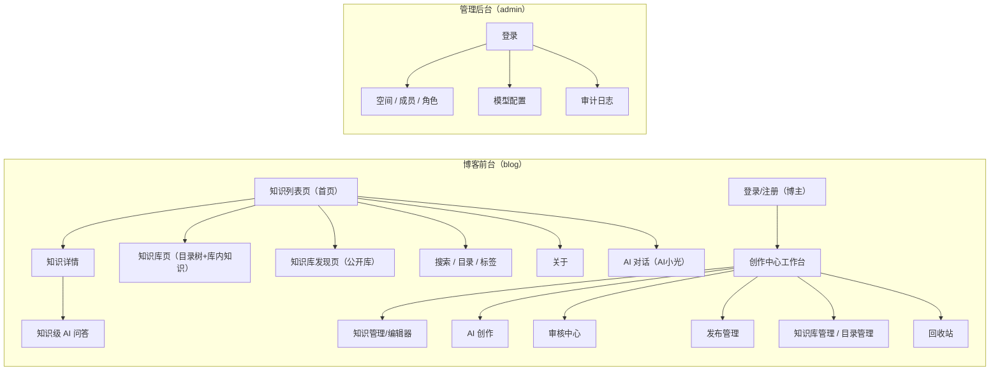
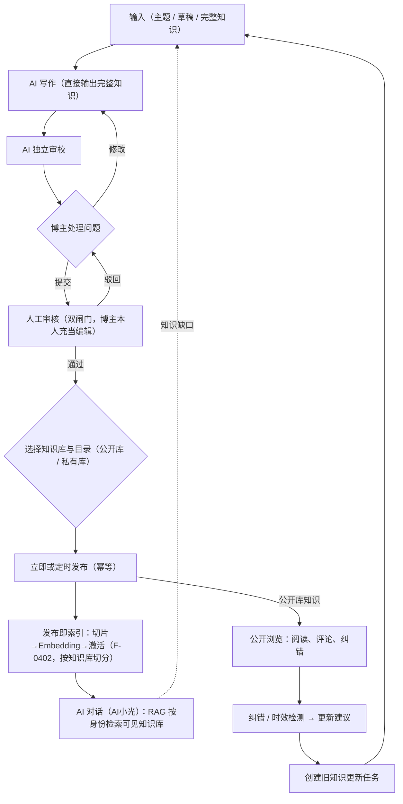

# xLumen 前端原型与交互文档

> 原型级别：低保真，默认画布：桌面端 1440 × 900，更新日期：2026/8/14
> **本仓库专属**。
> 引用原则：功能编号与阶段标注以[产品设计文档](../product/PRODUCT.md)第 5 节总表为唯一来源，本文不复制功能清单；阶段为规划非承诺（决策 D10），调整须经 CHANGELOG 记录并同步更新本文。

## 1. 使用说明

本文用于确认信息架构、页面职责、关键状态和操作路径，不代表最终像素级视觉稿。Mermaid 表达页面关系和业务流程，等宽文本表达页面线框。视觉令牌和工程约束见[前端开发文档](./FRONTEND.md)，技术基线与命令见[全局设计文档](../global/GLOBAL.md)。

## 2. 应用与角色入口

| 应用 | 面向角色 | 默认入口 | 核心任务 |
| --- | --- | --- | --- |
| 博客前台（xlumen-frontend-blog，:5173） | 访客（VISITOR）、登录读者、博主（OWNER） | 知识列表页（首页） | 阅读、搜索、评论、点赞、纠错、AI 对话、知识库浏览；博主额外获得创作中心：创作、审校、审核、发布、知识库与目录管理 |
| 管理后台（xlumen-frontend-admin，:5174） | 仅管理员（OWNER/ADMIN） | 管理后台登录页 | 空间/成员/角色、模型配置、审计日志等配置管理 |

- 知识创建、编辑、发布、阅读与互动**全部在博客前台**完成；管理后台不参与内容流转，只做横切配置。
- 博主与读者在博客前台同一应用内登录；管理员账号进入管理后台。

## 3. 信息架构



博客前台导航固定为：**知识 / 知识库 / AI小光**（F-0701 菜单标签统一为"AI小光"，位于知识库右侧、搜索框左侧）+ 全局搜索框；博主登录后追加创作中心入口（工作台）与「＋写知识」主按钮。管理后台导航固定为：空间、模型、审计（V2 追加配额、分析）。无权限菜单不展示；用户通过深链接访问无权限页面时显示解释页，不跳回首页掩盖问题。

## 4. 主业务闭环



双核心说明：产品具备两条核心能力线——内容创作（主线一）与 AI 知识对话（主线二，前台菜单入口「AI小光」F-0701）。知识可见性由所属知识库决定（F-0307）：私有库知识参与索引但仅库主可检索命中，公开库知识所有人可见；增值能力（F-0801/0802）作用于创作中的知识或已发布知识；旧知识更新重新走完整审核闭环并自动重建索引（F-1105）。

## 5. 全局框架

### 5.1 博客前台框架

```text
┌──────────────────────────────────────────────────────────────────────────────┐
│ ◆xLumen   知识   知识库   AI小光        [搜索知识/知识库…]   [＋写知识] [头像⌄]│
├──────────────────────────────────────────────────────────────────────────────┤
│                                 页面内容                                      │
├──────────────────────────────────────────────────────────────────────────────┤
│ 页脚：版权、RSS（V2）、隐私                                                  │
└──────────────────────────────────────────────────────────────────────────────┘
```

- 主导航：知识（首页知识流）/ 知识库（发现页）/ AI小光（AI 对话）；当前项洋红下划线高亮（纸刊编辑部风格）。
- 搜索框全局搜索：下拉联想分组（知识 N / 知识库 N / 目录 N），范围 = 当前身份可见内容。
- 已登录：洋红实心「＋写知识」直达编辑器；头像菜单 [创作中心] [我的知识库] [回收站] [个人设置] [退出登录]；顶栏追加 [任务] [通知] 入口（任务展示后台 AI 任务，通知 F-1004 V2）。
- 未登录：仅显示 [登录/注册]；访客可浏览公开内容。移动端：导航收汉堡菜单、搜索折叠为图标。

### 5.2 管理后台框架

```text
┌──────────────────────────────────────────────────────────────────────────────┐
│ xLumen Admin    [工作空间：我的博客⌄]                       [头像⌄]         │
├──────────────┬───────────────────────────────────────────────────────────────┤
│ 空间         │ 面包屑 / 页面标题                              [主要操作]    │
│ 模型         ├───────────────────────────────────────────────────────────────┤
│ 审计         │                        页面内容                               │
│ 配额(V2)     │                                                               │
│ 分析(V2)     │                                                               │
└──────────────┴───────────────────────────────────────────────────────────────┘
```

## 6. 页面清单（编号规则：B=博客前台应用（含创作中心）、A=管理后台、D=AI 对话组件；阶段以 PRODUCT.md 第 5 节总表为准）

- MVP：B00~B04、B08~B13、B16、B20~B23（博客）、A01~A04（管理后台）、D01/D02（AI 对话）；V2：B05、B07、B14、B15、B17~B19、B24、A05~A07；V3：B06。
- 每页小节标注对应功能编号、阶段、角色/入口、关键状态与核心交互。

## 7. 博客前台（B 系列）

### 7.1 B01 知识列表页（首页）（MVP · F-0201/F-0202/F-0208）

角色/入口：所有用户的默认主页。布局：左栏导航（目录树/标签/库列表）、**右栏主内容（知识列表）**。关键状态：加载骨架；无知识空态（区分「全站无公开知识/当前库无知识/筛选无结果」三种）；列表失败可重试。核心交互：卡片进详情；搜索框跳 B03；点赞/评论数展示；**知识流按身份聚合**——访客仅公开库已发布知识，登录用户额外包含自己私有库已发布知识（卡片 🔒 标记）；**排序：未选目录统一按更新时间倒序（固定，无切换按钮），选中目录后按创建时间正序**；库切换器切换后左栏目录树与列表联动；库 badge 点击跳 B20；标签点击筛选。

```text
┌──────────────────────────────────────────────────────────────────────────────┐
│ ◆xLumen   知识   知识库   AI小光        [搜索…]               [＋写知识] [头像]│
├──────────────────────────────────────────────────────────────────────────────┤
│ [全部知识库⌄]   更新时间倒序 · 选目录后按创建时间正序   共 128 篇             │
├─────────────────────┬────────────────────────────────────────────────────────┤
│ 目录（当前库）       │  知识列表                                             │
│  ▾ 前端开发          │  ┌──────────────────────────────────────────────────┐ │
│    ▸ Vue 原理 (12)   │  │【技术周刊】 更新于2天前   👍32 💬8               │ │
│    ▸ 工程化 (8)      │  │  深入理解 Vue 响应式原理                          │ │
│  ▾ 后端              │  │  摘要文字摘要文字摘要文字……                     │ │
│    ▸ Java 并发 (5)   │  ├──────────────────────────────────────────────────┤ │
│  ▸ AI 实践 (9)       │  │【默认私有库】🔒 更新于3天前（仅自己可见）         │ │
│                      │  │  我的 2026 年度书单                              │ │
│  标签云              │  │  摘要文字……                                      │ │
│  [读书][旅行][AI]    │  ├──────────────────────────────────────────────────┤ │
│                      │  │【生活随记】 更新于1周前                          │ │
│  我的知识库（登录）   │  │  ……                                            │ │
│  技术周刊 · 生活随记  │  └──────────────────────────────────────────────────┘ │
│                      │  分页：← 1 2 3 →                                    │
└─────────────────────┴────────────────────────────────────────────────────────┘
```

- 「全部知识库」状态下左栏展示公开库列表与「我的知识库」入口（V2 增加「我关注的库」筛选维度，F-0211）；选中某个库后左栏切换为该库的目录树 + 标签云，点目录过滤列表。
- 目录按名称排序（数据库排序规则）、每目录显示知识数、当前项高亮；选中目录后列表按**创建时间正序**（「目录下知识」规则，与库页 B20 一致），未选目录时统一按**更新时间倒序**。
- 私有库知识卡片仅登录库主可见（🔒 标记），访客视图中不存在该卡片；接口层由后端过滤，前端不参与鉴权。

### 7.2 B02 知识详情（MVP · F-0201 / F-0702 入口 / F-0405 引用）

角色/入口：访客从 B01/B03/B20 进入；登录用户额外获得知识级 AI 问答入口（F-0702 辅助入口）；私有库知识仅库主可通过创作中心链接访问。关键状态：仅读已发布不可变版本；下架/未发布显示不可访问解释。核心交互：面包屑「首页 /【知识库】/ 目录路径 / 标题」；目录导航；引用编号展开来源与定位（F-0405）；[问这篇 AI] 打开 D02（检索范围默认当前库，可切全部可见库）；点赞、评论、纠错（F-1001，提交生成可追踪反馈编号）。

```text
┌──────────────────────────────────────────────────────────────────────────────┐
│ 首页 /【技术周刊】/ 前端开发 / 深入理解 Vue 响应式原理                         │
├──────────┬─────────────────────────────────────────────────┬─────────────────┤
│ 本文目录 │ 标题 · 库badge · 作者 · 发布时间 · 更新时间 · 标签 │ 相关知识        │
│          │ 正文 Markdown 渲染                              │ （V2，F-0204）  │
│          │ 引用编号 [1] 可展开来源与定位（F-0405）         │                 │
│          │ [问这篇 AI] 知识级问答入口（F-0702）            │                 │
└──────────┴─────────────────────────────────────────────────┴─────────────────┘
```

### 7.3 B03 搜索/目录/标签（MVP · F-0202）

角色/入口：访客从首页搜索框或目录/标签链接进入。关键状态：搜索中骨架；无结果空态（关键词建议）；错误可重试。核心交互：关键词与目录/标签组合筛选；命中高亮；服务端分页；搜索结果仅含可见知识（按知识库可见性过滤，F-0307）。

```text
┌──────────────────────────────────────────────────────────────────────────────┐
│ [搜索关键词______________] [搜索]   知识库⌄  目录⌄  标签⌄                    │
├──────────────────────────────────────────────────────────────────────────────┤
│ 结果列表：标题、摘要（命中高亮）、库badge、目录路径、日期、阅读时间            │
│ 分页                                                                         │
└──────────────────────────────────────────────────────────────────────────────┘
```

### 7.4 B04 关于页（MVP）

角色/入口：访客从导航进入。核心交互：博主简介、联系方式、RSS 订阅入口（V2 生效）。

### 7.5 B00 AI 对话页（菜单入口）（MVP · F-0701）

角色/入口：前台导航 [AI小光] 菜单进入（位于知识库右侧、搜索框左侧）；登录用户完整对话，未登录用户受限预览并引导登录。关键状态：初始空态（示例网格引导）；对话流式中；检索中骨架；引用加载失败不影响回答正文；历史会话列表加载/空态。核心交互：侧边栏（新对话、问答历史）；中央聊天区（输入框、检索范围选择「全部可见库/仅当前库」、模型选择、发送）；**RAG 按身份检索可见知识库**——访客仅命中公开库已发布知识、库主命中全部含自己私有库（F-0407）；回答引用知识（参考卡片，引用编号可展开定位并跳转原文，F-0405）；示例网格引导。AI 助手统一称呼为**小光**（PRODUCT §8）。

```text
+------------------------------------------------------------------------------+
| ◆xLumen   知识   知识库   AI小光        [搜索] [深浅色切换] [头像]            |
+------------------+-----------------------------------------------------------+
| 侧边栏           | 你好，我是小光（xLumen AI 助手）                         |
| > 新对话         |                                                           |
|   问答历史       |  [总结我的知识] [技术问答] [内容对比] [写作灵感]           |
|                  |                                                           |
|                  |  检索范围：[全部可见库⌄]                                  |
|                  |  对话区                                                    |
|                  |  用户：请帮我总结最近关于微服务的知识                      |
|                  |  AI：根据您的 3 篇知识 [1][2][3]...                        |
|                  |  引用卡片：《微服务路由实践》§部署章节 → 跳转原文          |
|                  |                                                           |
|                  |  [输入问题或主题...] [模型选择] [发送]                     |
+------------------+-----------------------------------------------------------+
```

与 D01 的关系：B00 是整页形态（菜单入口），D01 是可浮动/抽屉唤起形态，两者复用同一组件与状态。

### 7.6 B05~B07、B24（V2/V3）

| 编号 | 页面 | 角色/入口 | 关键状态 | 核心交互 |
| --- | --- | --- | --- | --- |
| B05 | RSS 订阅（V2，F-0205） | 访客/订阅器，页脚 | 订阅源可用/失效 | 输出 RSS 2.0 订阅链接 |
| B06 | 知识归档（V3，F-0207） | 访客，导航入口 | 按年/月分组 | 时间轴归档、展开月份列表 |
| B07 | 访客 AI 助手·小光（V2，F-0703） | 访客，全站悬浮位 | 加载/回答/引用展开 | 基于公开库已发布知识回答，回复带引用可展开（F-0405） |
| B24 | 作者主页（V2，F-0209） | 访客，从库页/发现页作者名进入 | 加载/空态 | 作者简介、公开库列表、知识时间流（更新时间倒序）；按人浏览入口 |

### 7.7 知识库页与发现页（B20/B21，MVP · F-0208）

#### B20 知识库页

角色/入口：访客从 B01 库 badge、B03 结果或 B21 进入；私有库仅库主可进入，库主额外看到编辑入口。关键状态：库资料加载/空库空态；目录加载失败可重试。核心交互：左侧多级目录树（按目录名排序，每目录显示知识数）；右侧知识列表（更新时间倒序；进入目录后按创建时间正序；置顶知识排最前，V2 F-0310）；[+ 新建目录] 与 [✎编辑库资料] 仅库主可见；**目录树节点右键菜单（F-0312，仅库主）：重命名/删除（沿用目录删除连带规则，二次确认）/新增子目录，「全部知识」树根右键新增根目录，与 B01 左栏目录树行为一致**。

```text
┌──────────────────────────────────────────────────────────────────────────────┐
│ ← 返回    【技术周刊】 🔓公开   关注✚(V2)    知识 86 · 目录 7                  │
│   专注前端与 AI 工程的实践笔记……                                             │
├──────────────────────────────┬───────────────────────────────────────────────┤
│  目录                        │  更新时间倒序（进入目录后按创建时间正序）       │
│  ▾ 前端开发                  │  ┌─────────────────────────────────────────┐  │
│    ▸ Vue 原理      (12)      │  │ 深入理解 Vue 响应式原理  · 更新于3天前  │  │
│    ▸ 工程化        (8)       │  ├─────────────────────────────────────────┤  │
│  ▾ 后端                      │  │ 从零搭建 Monorepo       · 创建于1周前   │  │
│    ▸ Java 并发      (5)      │  └─────────────────────────────────────────┘  │
│  ▸ AI 实践          (9)      │                                               │
│  [+ 新建目录]（库主）        │                                               │
└──────────────────────────────┴───────────────────────────────────────────────┘
```

#### B21 知识库发现页

角色/入口：访客从导航 [知识库] 进入。关键状态：加载骨架；无公开库空态。核心交互：所有公开库卡片墙（封面/名称/简介/知识数，**默认按最近更新倒序**），点击进 B20；卡片「关注」按钮（V2，F-0211）；登录用户顶部附「我的知识库」入口（跳 B22）。

#### B23 个人收藏页（MVP · F-0212）

角色/入口：登录用户，头像下拉 [我的收藏]（`meta.authenticated`，路由 `/favorites`）。关键状态：加载骨架；无收藏空态（引导去逛知识库）；列表失败可重试。核心交互：收藏知识卡片流（标题/作者/所属库/摘要/收藏时间，点击进 B02）；卡片 [取消收藏] toggle 即时移除；分页。

### 7.8 创作中心（博主登录后，B08~B13、B16、B22 MVP）

#### B08 登录/注册（MVP · F-0101）

角色/入口：未登录用户（`meta.guest`）。关键状态：登录中；登录失败不暴露账号是否存在；注册成功即建空间。核心交互：登录/注册切换；忘记密码 V2（F-0105）；登录后进入首页，头像菜单出现 [创作中心]。

```text
┌──────────────────────────────────────────────────────────────────────────────┐
│          xLumen                                      欢迎回来                │
│   让可信知识照亮创作              邮箱 [____________]  密码 [____________]     │
│                                                      [      登录      ]     │
│                                                      注册账号 | 忘记密码(V2) │
└──────────────────────────────────────────────────────────────────────────────┘
```

#### B09 创作工作台（MVP · 聚合入口）

角色/入口：博主从头像菜单 [创作中心] 进入，创作中心落地页（`meta.workspace`）。关键状态：指标加载失败可重试；无任务空态。核心交互：指标卡片只展示可行动指标（待我审核、进行中任务、本月已发布、私有库知识数）；快捷操作 [创建知识]；顶栏任务/通知入口；D01 可从此页浮动唤起。

```text
┌──────────────────────────────────────────────────────────────────────────────┐
│ 创作工作台                                        [创建知识] [AI 助理]       │
├──────────────────┬──────────────────┬──────────────────┬────────────────────┤
│ 待我审核  2      │ 进行中任务  1    │ 本月已发布  18   │ 私有库知识  5       │
├─────────────────────────────────────┬────────────────────────────────────────┤
│ 创作流水线                          │ 待处理                                 │
│ 写作中 1  审校中 2                  │ · 2 篇知识待审核 / 1 索引失败          │
│ [查看全部任务]                      │                                       │
└─────────────────────────────────────┴────────────────────────────────────────┘
```

#### B10 知识列表/编辑器（MVP · F-0301/F-0302/F-0307/F-0308/F-0309）

角色/入口：博主从创作中心"知识"导航进入；编辑器支持深链接。关键状态：列表加载/空/错误/无权限/分页；编辑器保存中/已保存/保存失败/版本冲突四态；状态机 8 状态展示（F-0901）。核心交互：状态/知识库/目录筛选；**发布时选择目标知识库与目录（F-0307 库级可见性）**；同库内可换目录，跨库不提供移动（仅复制到新库或重新发布）；自动保存每 10 秒或失焦触发、内容未变化不发请求（F-0302）；冲突禁止静默覆盖，提供查看服务端版本/复制本地/基于最新继续编辑。

```text
┌──────────────────────────────────────────────────────────────────────────────┐
│ 知识管理        [知识库⌄] [目录⌄] [状态⌄] [🔍]        更新时间倒序 [新建知识] │
├────┬──────────────────────┬──────────────┬──────────┬──────────┬─────────────┤
│ □  │ 标题                 │ 知识库/目录   │ 状态     │ 更新时间 │ 操作        │
│    │ 多模型路由实践       │ 技术周刊/前端 │ 待审核   │ 10 分钟前│ [编辑][更多] │
│    │ 随笔草稿             │ 默认私有库/—🔒│ 草稿     │ 1 小时前 │ [编辑][更多] │
└────┴──────────────────────┴──────────────┴──────────┴──────────┴─────────────┘
更多：复制到新库 · 移入回收站
```

编辑器：左侧知识信息（知识库/目录/标签/封面），中间 Markdown 编辑区（大纲/所见即所得/源码切换），右侧按需打开 AI 面板（复用 B11/AI 增值面板）。底栏：`保存状态：已保存 | 版本 v7 | 字数 3,428 | [提交审核]`。

#### B11 AI 创作任务页（MVP · F-0601~F-0604）

角色/入口：博主从工作台/知识页发起创作任务进入。关键状态：任务 Queued/Running/WaitingApproval/Completed/Failed/Cancelled；流式内容与博主正在编辑区域冲突时不得覆盖，生成结果进入候选版本；关闭页面任务继续执行，返回时从最后事件序号恢复。核心交互：输入主题/草稿/完整知识 → AI 直接输出完整知识（F-0601）；大纲可选确认（F-0602，V2）；知识增强写作检索可见知识库作参考（F-0603，V2）；审校报告按严重度/位置/证据/建议列出（F-0604），严重问题未处理默认禁止提交；[重新审校] [保存修改] [提交人工审核]。

```text
┌───────────────┬──────────────────────────────────────────┬───────────────────┐
│ 流程          │ 知识                                    │ AI 助手           │
│ ● AI 写作     │ 标题 [______________________________]   │ 当前：流式写作    │
│ ○ AI 审校     │                                          │ ███████░ 72%      │
│ ○ 提交审核    │ [大纲] [所见即所得] [Markdown]           │ 证据 12 条        │
│               │ # 正文 ……流式生成内容……                │ [暂停] [取消]     │
├───────────────┴──────────────────────────────────────────┴───────────────────┤
│ 保存状态：已保存 | 版本 v7 | 字数 3,428 | [查看 Trace] [提交审校]            │
└──────────────────────────────────────────────────────────────────────────────┘
```

AI 增值面板（MVP · F-0801/F-0802）：在编辑器/AI 创作页右侧打开，摘要生成、SEO 优化（标题/关键词/描述）；结果卡片含模型、耗时与引用来源；[应用到正文] [复制] [重新生成]；翻译（V2，F-0803）、配图（V2，F-0804）后续加入同一面板。

#### B12 审核中心（MVP · F-0902~F-0904）

角色/入口：博主（个人博主本人充当编辑角色）；V2 团队模式编辑不能审核自己提交的知识（F-0903）；个人空间可关闭强制审核（D9）。关键状态：待审核/已处理；审核期间正文变化使原审核失效（409 版本校验）。核心交互：详情采用正文、版本差异、AI 审校和证据并排视图；通过/驳回均校验版本；驳回必填原因、问题位置、期望修改（F-0904）。

```text
┌──────────────────────────────────────────────────────────────────────────────┐
│ 审核中心                                                                     │
├──────────────────────────────────────────────────────────────────────────────┤
│ 待审核  已处理                     风险⌄  提交时间⌄                         │
├──────────────────────────┬────────────┬──────────┬──────────┬────────────────┤
│ 知识                     │ 知识库      │ 风险     │ 版本     │ 操作           │
│ 多模型路由实践           │ 技术周刊    │ 2 严重   │ v7       │ [开始审核]     │
└──────────────────────────┴────────────┴──────────┴──────────┴────────────────┘
```

审核底栏：[驳回修改] [通过并进入发布] [通过并定时发布]；通过确认展示版本、目标知识库与目录、发布时间、风险摘要；驳回必填三要素（F-0904）。

#### B13 发布管理（MVP · F-0901/F-0905/F-0307）

角色/入口：博主。关键状态：待发布/已发布/已下架；定时发布到期执行幂等检查，重复任务不产生重复公开版本（F-0905）。核心交互：立即发布、定时发布（V2，F-0304 联动）、下架回滚（V2，F-0906）均二次确认并展示版本、目标知识库与影响范围；发布确认弹窗选择知识库与目录（公开库提示「发布后所有人可见并进入知识列表」，私有库提示「仅自己可见」）；失败任务保留重试和人工补偿入口。

```text
┌──────────────────────────────────────────────────────────────────────────────┐
│ 发布管理                                                                      │
├──────────────────────────────────────┬───────────────────────────────────────┤
│ 待发布                                │ 最近发布                              │
│ 20:00 多模型路由实践（技术周刊·公开） │ 知识、版本、知识库、状态、发布时间    │
│ [预览] [调整时间] [取消计划]          │                                       │
│ 发布确认：版本、知识库与目录、时间、风险摘要（幂等，F-0905）                   │
└──────────────────────────────────────┴───────────────────────────────────────┘
```

#### B16 回收站（MVP · F-0305/F-0308）

角色/入口：博主，头像菜单 [回收站] 或知识管理页入口。关键状态：加载/空态；删除时间与剩余天数展示。核心交互：[知识库] [知识] 双 Tab；恢复（知识恢复回原库原目录、知识库连带恢复）；勾选批量恢复/彻底删除（V2，F-0311）；彻底删除红色按钮 + 二次确认（知识库行明示「将连带删除 N 篇知识」）；提示「回收站条目保留 30 天，超期自动彻底删除」。

```text
┌──────────────────────────────────────────────────────────────────────────────┐
│ 回收站        [知识库] [知识]                                                  │
│ 提示：回收站条目保留 30 天，超期自动彻底删除。                                 │
├──────────────────────────────────────────────────────────────────────────────┤
│ 名称/标题            类型      删除时间   剩余天数    操作                    │
│ 读书笔记（41篇）     知识库    昨天 14:02   29天   [恢复] [彻底删除]           │
│ 旧版知识.md          知识      3天前        27天   [恢复] [彻底删除]           │
└──────────────────────────────────────────────────────────────────────────────┘
```

#### B22 知识库管理页（MVP · F-0308/F-0309）

角色/入口：博主，头像菜单 [我的知识库]。关键状态：加载/空态；删除确认弹窗。核心交互：知识库卡片墙（封面/名称/🔓🔒/知识数/目录数），[+ 新建知识库]（名称/简介/可见性）；卡片操作：编辑资料、目录管理（目录树多级增删改、按名称排序、拖拽排序）、公开/私有切换（即时生效并提示影响范围）、删除（二次确认「库内 N 篇知识将一并移入回收站」）。

```text
┌──────────────────────────────────────────────────────────────────────────────┐
│ 我的知识库                                    [+ 新建知识库]                 │
├─────────────────────┬─────────────────────┬──────────────────────────────────┤
│ ┌─────────────────┐ │ ┌─────────────────┐ │ ┌──────────────────────────────┐ │
│ │ 封面图           │ │ │ 封面图           │ │ │ 封面图                        │ │
│ │ 技术周刊        │ │ │ 生活随记        │ │ │ 读书笔记                      │ │
│ │ 🔓公开 · 86篇    │ │ │ 🔓公开 · 23篇    │ │ │ 🔒私有 · 41篇                 │ │
│ │ [编辑][目录][删除]│ │ │ [编辑][目录][删除]│ │ │ [编辑][目录][删除]            │ │
│ └─────────────────┘ │ └─────────────────┘ │ └──────────────────────────────┘ │
└─────────────────────┴─────────────────────┴──────────────────────────────────┘
```

### 7.9 B14~B19（V2，B16 已提升为 MVP 见 7.8）

| 编号 | 页面 | 角色/入口 | 关键状态 | 核心交互 |
| --- | --- | --- | --- | --- |
| B14 | 版本历史（F-0303） | 博主，知识页"更多" | 版本列表/差异视图 | 对比任意两版本、回滚（校验版本） |
| B15 | 定时发布（F-0304） | 博主，发布管理 | 计划待执行/已执行/失败 | 设定时间、调整、取消；幂等发布 |
| B17 | 图片管理（F-0306） | 博主，编辑器附件 | 上传中/已上传/失败 | 上传、压缩、选择插入正文（MinIO） |
| B18 | 配额面板（F-0504） | 博主，工作台-配额 | 预占/结算/释放 | 用量统计、额度告警、超限引导 |
| B19 | 通知中心（F-1004） | 登录用户，顶栏通知入口 | 未读/已读 | 审核结果、评论回复、纠错处理；WebSocket 推送 |

## 8. 管理后台（A 系列，仅管理员）

> 管理后台不参与内容流转，只承载横切配置：空间/成员/角色、模型配置、审计日志（V2 追加配额与分析）。

### 8.1 A01 登录（MVP · F-0101）

角色/入口：管理员账号（`meta.guest`）。关键状态：登录中；登录失败不暴露账号是否存在。核心交互：仅管理员角色可进入后台；无权限账号登录后提示并引导回博客前台。

### 8.2 A02 空间 / 成员 / 角色设置（MVP · F-1201 / F-0102 / F-0103）

角色/入口：OWNER/ADMIN。关键状态：保存中/已保存；成员列表加载/空态。核心交互：空间基本信息；成员邀请与移除（V2 团队模式）；角色分配（OWNER/ADMIN/EDITOR/AUTHOR）与权限说明；强制审核开关（D9）；权限变更即时生效并记审计日志（F-1202）。

```text
┌──────────────────────────────────────────────────────────────────────────────┐
│ 空间设置                                                                      │
├──────────────┬───────────────────────────────────────────────────────────────┤
│ 基本信息     │ 空间名称 [我的博客____]  简介 [______________]                │
│ 成员(V2)     │ 强制审核 [开⌄]（个人空间可关闭，D9）                          │
│ 角色权限     │ [保存]                                                        │
│ 发布设置     │                                                               │
└──────────────┴───────────────────────────────────────────────────────────────┘
```

### 8.3 A03 模型配置（MVP · F-0501/F-0502）

角色/入口：OWNER/ADMIN。关键状态：连通性测试中/成功/失败；保存中/已保存。核心交互：供应商管理（百炼/DeepSeek，API Key 密文存储与连通性测试）；场景模型分配（Writing/Reviewer/问答/摘要/Embedding 各自选择供应商与模型）；密钥不出现在界面明文、日志与接口响应中。

```text
┌──────────────────────────────────────────────────────────────────────────────┐
│ 模型配置                                                                      │
├──────────────┬───────────────────────────────────────────────────────────────┤
│ 供应商       │ 百炼    API Key [********] [测试连通性] ✅                    │
│ 场景分配     │ DeepSeek API Key [********] [测试连通性] ✅                   │
│              ├───────────────────────────────────────────────────────────────┤
│              │ 场景        │ 供应商   │ 模型             │ 操作             │
│              │ Writing     │ 百炼     │ qwen-max         │ [更换]           │
│              │ Reviewer    │ DeepSeek │ deepseek-chat    │ [更换]           │
│              │ 问答/摘要   │ 百炼     │ qwen-plus        │ [更换]           │
│              │ Embedding   │ 百炼     │ text-embedding-v4│ [更换]           │
└──────────────┴───────────────────────────────────────────────────────────────┘
```

### 8.4 A04 审计日志（MVP · F-1202）

角色/入口：OWNER/ADMIN。关键状态：日志列表加载/空态；检索中。核心交互：发布/删除/权限变更/模型配置变更留痕；按操作人、类型、时间检索；只读不可篡改。

### 8.5 A05~A07（V2）

| 编号 | 页面 | 角色/入口 | 关键状态 | 核心交互 |
| --- | --- | --- | --- | --- |
| A05 | 配额管理（F-0504） | OWNER/ADMIN，配额导航 | 预占/结算/释放 | 额度设置、用量统计、超限策略 |
| A06 | 数据看板（F-1101） | OWNER/ADMIN，分析导航 | 数据加载/空态 | 阅读趋势、热门知识、时间范围切换 |
| A07 | 时效检测（F-1102） | OWNER/ADMIN，分析导航 | 检测中/完成/过期清单 | 引用过期检测、创建更新任务入口（F-1104） |

## 9. AI 对话（D 系列）

### 9.1 D01 空间级 AI 对话组件（MVP · F-0701；与 B00 关系）

- B00（前台 [AI小光] 菜单页）与 D01（对话界面本体）**实现为同一页面**：B00 提供整页形态；D01 为该页面的对话组件，可从创作工作台（B09）以抽屉/悬浮形态唤起，两者复用同一组件与状态，不重复实现。
- 关键状态：回答流式中；引用加载失败不影响正文回答；断线后从最后事件序号恢复（SSE）。核心交互：RAG 按身份检索可见知识库（访客仅公开库已发布、库主含自己私有库，F-0407）+ 引用溯源展开与跳转原文（F-0405）；检索范围选择器（全部可见库/仅当前库）；会话历史可回溯。

```text
┌──────────────────────────────────────────────────────────────────────────────┐
│ 小光 · AI 对话                                      [最大化] [关闭]            │
│ 基于可见知识库回答；回复引用带证据 [1][2]，可展开定位并跳转原文（F-0405）      │
│ [检索范围：全部可见库⌄] [输入问题________________] [发送]                     │
└──────────────────────────────────────────────────────────────────────────────┘
```

### 9.2 D02 知识级问答弹窗（MVP · F-0702）

角色/入口：登录用户在 B02 知识详情点击 [问这篇 AI] 打开；组件归属 `chat` 模块。关键状态：回答流式中；仅基于该篇已发布不可变版本，无引用时标注模型生成而非事实。核心交互：单篇问答（检索范围默认当前库，可切全部可见库）、引用定位到段落（F-0405）；[展开为整页] 进入 B00 会话。

```text
┌──────────────────────────────────────────────────────────────────────────────┐
│ 问这篇 AI ·《多模型路由实践》（小光）             [展开] [关闭]              │
│ 仅基于本篇已发布版本回答，引用定位到段落（F-0702/F-0405）                    │
│ [输入问题________________] [发送]                                            │
└──────────────────────────────────────────────────────────────────────────────┘
```

## 10. 响应式规则

| 宽度 | 规则 |
| --- | --- |
| ≥ 1280px | 完整导航；创作页三栏 |
| 768–1279px | 导航折叠；创作页右栏使用抽屉；支持完整审核 |
| < 768px | 底部或抽屉导航；只支持阅读、通知、评论和轻量审批 |

移动端不提供完整 Markdown 编辑和复杂模型配置。必须在移动端完成的审批操作展示版本、风险和关键差异，不能只提供孤立的"通过"按钮。

## 11. 页面通用状态

每个列表和详情页都必须定义：

1. 首次加载骨架（含流式任务的部分内容已就绪态）。
2. 无数据时的解释和下一步操作。
3. 可重试错误及请求 ID（`requestId` 展示入口，F-1303）。
4. 403 无权限原因和申请路径；404 区分资源不存在与无权查看（私有库知识对非库主返回 404）；429 限流提示与重试等待（如评论防刷、AI 请求超限）。
5. 资源已删除、已下架或版本过期状态（409 版本冲突恢复入口）。
6. 后台任务仍在运行时的离开与恢复行为。

## 12. 原型验收清单

- 博主从创作中心连续走到发布（输入→AI 写作→审校→审核→选知识库与目录→发布），发布成功后知识自动进入 RAG 索引（按知识库切分）。
- 博主在 AI 对话（B00）能检索到自己的全部知识（含私有库）；访客仅能命中公开库已发布知识；引用可展开定位并跳转原文。
- 私有库知识不出现在公开列表、搜索与 URL 中；登录博主首页可见自己私有库已发布知识（🔒 标记）。
- 知识列表统一按更新时间倒序；目录按名称排序（数据库排序规则）；目录内知识按创建时间正序。
- 删除知识库连带进入回收站，可恢复或彻底删除；跨库移动入口不存在（仅复制到新库或重新发布）。
- 审核驳回包含三要素；发布者能预览、定时发布、处理失败，重复点击不产生重复发布。
- 用户能从任务中心恢复中断的 AI 或索引任务；所有危险操作均说明对象、版本和影响范围。
- 平板可以完成审核，移动端可以完成明确范围的轻量审批。
- 公开知识能阅读来源引用、评论、点赞和提交纠错；知识级问答可用。
- 管理员能在管理后台完成空间/成员/角色设置、模型配置（密钥安全）与审计日志查询。
- MVP 页面（B00~B04、B08~B13、B16、B20~B22、A01~A04、D01/D02）全部可走通；V2/V3 页面编号与阶段调整须经 CHANGELOG 记录并同步本文（决策 D10）。
