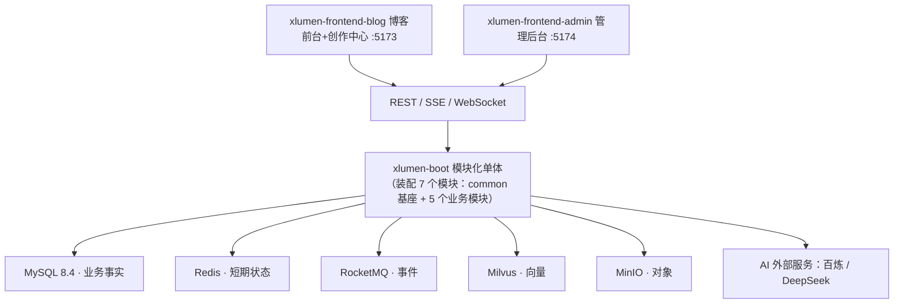

# xLumen 全局文档

> 更新日期：2026/8/17
> **本仓库专属**。
> 适用范围：项目概览、文档导航、总体架构、仓库结构、技术基线、本地运行命令与质量门禁、扩展性路线图。
> 引用原则：**引用不复制**——架构图（第 3 节）、技术基线（第 5 节）、运行与质量门禁命令（第 6/7 节）全仓唯一维护在本文档；功能清单唯一来源为 PRODUCT.md 第 5 节总表；内容状态机文字版见 PRODUCT.md 第 4 节。

## 1. 项目概览

xLumen 是多用户 AI 知识平台：注册用户创建自己的知识库（公开/私有），用多级目录组织知识（即文章），前台主页为知识列表页（按身份聚合，公开库知识带库标记），AI 对话（AI小光）为前台菜单入口（RAG 按身份检索可见知识库生成回答并引用来源），知识的创建、编辑、发布、阅读与互动全部在前台完成；管理后台仅供管理员进行空间、模型与审计等配置管理。

内容闭环一句话：**输入 → AI 写作 → 审校 → 审核 → 发布（发布即索引）→ 反馈 → 更新**（详见 PRODUCT.md 第 3 节）。AI 知识对话为产品核心能力线之一。

13 个产品模块一句话概览（功能编号与阶段以 PRODUCT.md 第 5 节总表为唯一来源，总表统计：MVP 39 / V2 31 / V3 12）：

| # | 模块 | 一句话职责 | 阶段 |
| --- | --- | --- | --- |
| 一 | 身份与多租户 | 注册登录、工作空间、多角色权限与双层校验、私有库授权（F-0101~F-0106） | MVP/V2 |
| 二 | 博客前台 | 公开知识阅读、目录标签搜索、知识库浏览与切换、评论点赞与 SEO（F-0201~F-0208） | MVP/V2/V3 |
| 三 | 内容管理 | 知识 CRUD、Markdown 编辑器、知识库/目录管理、回收站、草稿自动保存与版本（F-0301~F-0309） | MVP/V2 |
| 四 | 知识索引（RAG） | 发布即索引流水线（按知识库切分）、索引管理与检索、权限过滤与引用溯源（F-0402~F-0405、F-0407） | MVP |
| 五 | AI 核心引擎 | 模型网关（百炼/DeepSeek 隔离）、场景模型配置、SSE 流式与配额（F-0501~F-0505） | MVP/V2/V3 |
| 六 | AI 内容创作 | AI 写作（直接输出完整知识）、大纲可选确认、知识增强写作与独立模型审校（F-0601~F-0607） | MVP/V2/V3 |
| 七 | AI 对话 | AI 对话（前台菜单入口「AI小光」，RAG 按身份检索可见知识库）、知识级问答、访客助手（F-0701~F-0705） | MVP/V2/V3 |
| 八 | AI 内容增值 | 摘要、SEO、翻译、配图、自动标签（F-0801~F-0807） | MVP/V2/V3 |
| 九 | 审核与发布 | 8 状态内容状态机、双闸门审核、发布幂等与回滚下架（F-0901~F-0906） | MVP/V2 |
| 十 | 互动与反馈闭环 | 读者纠错、评论点赞、通知系统（F-1001~F-1004） | MVP/V2/V3 |
| 十一 | 数据分析与知识保鲜 | 访问统计、时效检测、知识缺口分析与旧知识更新闭环（F-1101~F-1105） | V2/V3 |
| 十二 | 平台治理 | 空间设置、审计日志（MVP）、AI 运行监控与敏感内容检测（V2/V3）（F-1201~F-1204） | MVP/V2/V3 |
| 十三 | 技术基础设施 | Redis 缓存、异步任务、统一响应、事件解耦与深浅色主题切换（F-1301~F-1306） | MVP/V2/V3 |

## 2. 文档导航

| 文档 | 职责 | 权威范围 |
| --- | --- | --- |
| [README.md](../../README.md) | 仓库入口：定位、AI 开发者入口、文档导航与快速开始 | 快速开始与本文第 6 节同源一致 |
| [全局文档](./GLOBAL.md)（本文件） | 项目概览、文档导航、总体架构、仓库结构、技术基线、运行命令、质量门禁、扩展路线 | 架构图/技术基线/命令全仓唯一 |
| [产品设计文档](../product/PRODUCT.md) | 产品定位、角色、业务闭环、内容状态机、功能总表、行为规则、完成定义 | 功能清单与产品行为唯一事实源 |
| [后端开发文档](../backend/BACKEND.md) | 后端模块、MVC 规则、数据规则、接口、配置与性能约束 | 后端工程实现 |
| [前端开发文档](../frontend/FRONTEND.md) | 前端工程结构、状态管理、接口与视觉规范 | 前端工程实现 |
| [前端原型文档](../frontend/PROTOTYPE.md) | 页面结构、线框、交互流程与页面状态 | 页面结构 |
| [开发状态与交接文档](../ai/STATUS.md) | 多 AI 协作工作流、里程碑、待办认领、已知问题、决策摘要 | 会话交接核心 |
| [AI 变更日志](../ai/CHANGELOG.md) | 按会话倒序的变更记录 | 变更记录唯一来源 |
| [待修问题清单](../ai/BUGS.md) | 用户自测缺陷记录与修复状态 | 缺陷清单唯一来源（仅按用户明确要求修复） |
| [功能想法池](../ai/IDEAS.md) | 用户功能想法收集与评估状态 | 想法清单唯一来源（采纳须经 PRODUCT 功能总表登记） |

阅读顺序：

- **AI 代理路径**：README → STATUS → PRODUCT → BACKEND → FRONTEND。
- **人类路径**：README → PRODUCT → PROTOTYPE → GLOBAL。

冲突裁决规则：

- 产品行为以 PRODUCT.md 为准；工程实现以 BACKEND.md / FRONTEND.md 为准。
- 运行与质量门禁命令以本文档（GLOBAL）为准；变更记录以 CHANGELOG.md 为准。

引用不复制原则：架构图（第 3 节）、技术基线（第 5 节）、命令（第 6/7 节）、内容状态机（PRODUCT 第 4 节）、功能清单（PRODUCT 第 5 节）全仓唯一，其他文档只引用不复制。

## 3. 总体架构



系统以单一 Spring Boot 进程运行（决策 D1）；耗时任务由 RocketMQ 消费者与定时任务异步执行，最终仍通过所属模块 Service 完成业务处理。中间件故障影响面：

- **Redis**：只存缓存、会话、限流与短期任务状态（决策 D6），不可用时按业务风险降级或拒绝，业务事实在 MySQL，不影响审核与发布。
- **RocketMQ**：事件与业务数据在同一本地事务写入（Outbox，决策 D3），积压不丢业务事实，恢复后按序消费、消费者幂等。
- **Milvus**：向量检索不可用时 AI 对话引用溯源能力降级（问答提示无检索依据或明确失败），不产生无依据输出。
- **MinIO**：对象存储不可用时配图/图片上传失败（V2），已发布内容读取不受影响（正文事实在 MySQL）。
- **AI 外部服务**：供应商不可用按场景降级/熔断（如 Reviewer 切换备用模型），降级原因进入 AI Trace（F-0505）。

## 4. 仓库结构

```text
xlumen/
├─ docs/                                # 文档体系（10 份）
│  ├─ ai/STATUS.md                      # 开发状态与交接（AI 必读）
│  ├─ ai/CHANGELOG.md                   # AI 变更日志
│  ├─ ai/BUGS.md                        # 待修问题清单（仅按用户明确要求修复）
│  ├─ ai/IDEAS.md                       # 功能想法池（采纳须登记 PRODUCT 功能总表）
│  ├─ product/PRODUCT.md                # 产品设计（功能总表唯一事实源）
│  ├─ backend/BACKEND.md                # 后端开发文档
│  ├─ frontend/FRONTEND.md              # 前端开发文档
│  ├─ frontend/PROTOTYPE.md             # 前端原型文档
│  └─ global/GLOBAL.md                  # 全局文档（本文件）
├─ README.md                            # 仓库入口（本次交付已存在）
├─ backend/xlumen-server/               # 后端（M01 代码骨架阶段创建）
│  ├─ pom.xml                           # 父 POM：聚合与依赖管理
│  ├─ sql/init/                         # 初始化 SQL：00_database.sql ~ 95_analytics.sql（编号契约见 BACKEND.md §7）
│  ├─ config/.env.example               # 配置模板（决策 D8；.env 不入库）
│  ├─ xlumen-common/                    # 基座：ApiResponse/BizException/WorkspaceContext/RequestId
│  ├─ xlumen-identity/                  # 身份与多租户 + 平台治理（iam_ + plt_）
│  ├─ xlumen-content/                   # 内容管理 + 数据分析与知识保鲜（cnt_ + analytics_）
│  ├─ xlumen-publishing/                # 审核发布与公开读 + 互动反馈（pub_ + eng_）
│  ├─ xlumen-knowledge/                 # 知识库与目录管理 + 知识索引 RAG：发布即索引（kb_）
│  ├─ xlumen-ai/                        # AI 引擎 + 对话 + 增值（ai_ + chat_ + ai_enhance_）
│  └─ xlumen-boot/                      # 装配层：唯一启动入口
├─ frontend/xlumen-frontend-blog/       # 博客前台（含创作中心，M01 骨架阶段创建，5173）
├─ frontend/xlumen-frontend-admin/      # 管理后台（仅管理员，M01 骨架阶段创建，5174）
├─ scripts/init-db.ps1                  # 数据库初始化脚本（M01 骨架阶段创建，参数 -EnvFile）
├─ package.json                         # 根脚本代理：pnpm --dir frontend/xlumen-frontend-blog / --dir frontend/xlumen-frontend-admin（M01 骨架阶段创建）
├─ pnpm-workspace.yaml                  # Monorepo：声明 blog + admin 双应用（M01 骨架阶段创建）
├─ .editorconfig                        # 编辑器统一配置（M01 骨架阶段创建）
└─ .gitignore                           # 忽略 .env、node_modules、target 等（M01 骨架阶段创建）
```

> 标注说明：docs/ 与根 README.md 为文档体系交付（初版 7 份；BUGS.md 于 2026-08-16 新增）；backend/、frontend/、scripts/ 与根工程配置（package.json、pnpm-workspace.yaml、.editorconfig、.gitignore）已随 M01 代码骨架创建（2026-08-12 交付）。目录结构以本文与 BACKEND/FRONTEND 契约为准（决策 D7 文档先行，代码骨架不得偏离）。

## 5. 技术基线

版本基线全仓唯一；框架或核心依赖升级必须单独验证（BACKEND.md / FRONTEND.md 只引用本文，不重复版本号）。

**后端**：JDK 25 · Maven 3.9 · Spring Boot 4.1.0（模块化单体，决策 D1）· Spring MVC / Validation / Security（OAuth2 resource-server + jose）· MyBatis-Plus 3.5.16（`mybatis-plus-spring-boot4-starter` + `mybatis-plus-jsqlparser`）· Hutool 5.8.38 · Lombok（JDK 23+ 必须显式声明 `annotationProcessorPaths`）· springdoc-openapi（OpenAPI 契约唯一来源，决策 D4）· Actuator + Micrometer。测试：JUnit 5 · AssertJ · Mockito · Spring Boot Test · WireMock · ArchUnit · k6。

**前端**：Vue 3.5 · Vite 7 · TypeScript 5.8（strict + noUncheckedIndexedAccess + exactOptionalPropertyTypes + noImplicitOverride）· Pinia 3 · Element Plus · Vue Router · Axios · Vitest + Vue Test Utils · Playwright · ESLint 9 flat config · Stylelint · Prettier。

**中间件**：MySQL 8.4（业务事实）· Redis（短期状态）· RocketMQ（事件）· Milvus（向量）· MinIO（对象）。

**Monorepo**：pnpm 管理 xlumen-frontend-blog + xlumen-frontend-admin 双应用，根 package.json 代理两应用脚本，质量门禁统一在仓库根执行。

## 6. 本地运行

### 6.1 前置环境

| 工具 | 版本要求 | 用途 |
| --- | --- | --- |
| Git | 最新稳定版 | 版本控制 |
| JDK | 25（`JAVA_HOME` 必须指向 JDK 25） | 后端编译与运行 |
| Maven | 3.9 | 后端构建 |
| Node.js | 20+ | 前端运行 |
| pnpm | 9+ | 前端依赖管理（Monorepo） |
| MySQL 客户端 | 8.4 配套 | 数据库初始化与检查 |

> 本机不安装 yq：初始化脚本直接解析 `.env`（真实参数为 `-EnvFile`）。MySQL、Redis、RocketMQ、Milvus、MinIO 使用现有服务器实例，需提前取得地址、账号、密码与访问白名单。

### 6.2 配置准备

复制模板并填写真实值（`.env` 已加入 `.gitignore`，真实值不得提交；Windows 下必须以 UTF-8 无 BOM 编码保存）：

```powershell
Copy-Item backend/xlumen-server/config/.env.example backend/xlumen-server/config/.env
```

`application.yml` 通过 `spring.config.import` 加载 `.env`（`optional:file:config/.env[.properties]`，含 `../config/`、`backend/xlumen-server/config/` 相对路径回退），变量统一 `${XLUMEN_XXX}` 命名（如 `XLUMEN_DB_URL`、`XLUMEN_JWT_SECRET`、`XLUMEN_BAILIAN_API_KEY`）。

### 6.3 初始化数据库

```powershell
./scripts/init-db.ps1 -EnvFile "./backend/xlumen-server/config/.env"
```

`init-db.ps1` 真实参数为 `-EnvFile`（默认 `../backend/xlumen-server/config/.env`）：解析 `.env` 的 `KEY=VALUE` 行（跳过 `#` 注释），读取 `XLUMEN_DB_URL` / `XLUMEN_DB_USERNAME` / `XLUMEN_DB_PASSWORD`，按编号顺序执行 `backend/xlumen-server/sql/init/` 全部脚本。

### 6.4 启动后端

```powershell
cd backend/xlumen-server
mvn -pl xlumen-boot -am spring-boot:run
```

或打包后运行（默认地址 `http://localhost:8080`，健康检查 `http://localhost:8080/actuator/health`）：

```powershell
cd backend/xlumen-server
mvn -pl xlumen-boot -am package -DskipTests
java -jar xlumen-boot/target/xlumen-boot-*.jar
```

### 6.5 启动前端

仓库根目录执行（根 package.json 通过 `pnpm --dir` 代理两应用脚本；首次运行先在根目录 `pnpm install`）：

```powershell
pnpm --dir frontend/xlumen-frontend-blog dev     # 博客前台（含创作中心） http://localhost:5173
pnpm --dir frontend/xlumen-frontend-admin dev    # 管理后台 http://localhost:5174
```

## 7. 质量门禁

后端（`backend/xlumen-server/` 目录执行）：

```powershell
cd backend/xlumen-server
mvn -T 1C clean verify
```

前端（仓库根目录，按顺序执行且全部通过）：

```powershell
pnpm lint
pnpm stylelint
pnpm typecheck
pnpm test
pnpm build
pnpm test:e2e
```

验收标准：功能完成必须满足 PRODUCT.md 第 12 节完成定义，并结合 BACKEND.md 第 22 节与 FRONTEND.md 第 17 节完成定义验收；文档必须与代码实际状态一致（STATUS.md 工作流最高规则）。

## 8. 扩展性路线图

| 阶段 | 形态 | 触发条件 |
| --- | --- | --- |
| 1（现状/MVP） | 模块化单体，`xlumen-boot` 唯一入口，**强制单实例** | 当前状态，不拆分 |
| 2 | AI 消费者独立进程（拆分 AI 长任务执行与消息消费） | RocketMQ 队列积压持续超过阈值（阈值经监控与压测校准） |
| 3 | 公开读路径独立服务（拆分博客前台读接口） | 单实例 CPU 或连接数持续超过阈值（阈值经压测校准） |

> 所有拆分均以触发条件表述，未达触发条件不得拆分；MVP 阶段强制单实例部署（并发假设见 PRODUCT.md 第 11 节 NFR）。
